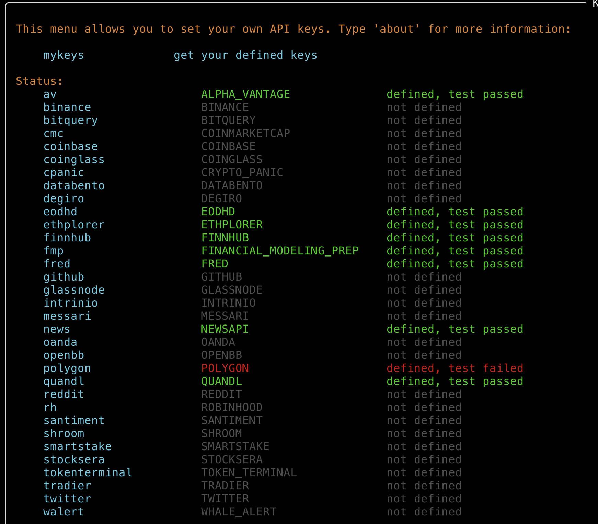

# marketdata
APIs for free and low-cost market data

# Financial Market Data APIs
- How to access datafeeds used by [OpenBB](https://openbb.co/) and mentioned in [this post](https://medium.com/@peteramaral/want-to-be-informed-like-a-hedge-fund-manager-add-these-api-keys-to-your-openbb-terminal-8f96c2256b22)
- [Alpha Vantage](https://www.alphavantage.co/)
- [Polygon](https://polygon.io/)
- [FRED](https://fred.stlouisfed.org/)
- [EODHD](https://eodhistoricaldata.com/)
- [FinnHub](https://finnhub.io/)
- [FMP](https://site.financialmodelingprep.com/)
- [NewsAPI](https://newsapi.org/)
- [Stocksera](https://stocksera.pythonanywhere.com/)
- [Quandl](https://demo.quandl.com/) (possibly discontinued)
- Didn't install 
    - crypto-related stuff
    - [IEX](https://iexcloud.io/pricing) (looks super interesting but data bundles are expensive)
    - [Databento](https://databento.com/pricing) (looks interesting and reasonably priced market data, just using free tier for now)
    - [Oanda](https://www.oanda.com/foreign-exchange-data-services/en/exchange-rates-api/free-trial/) (don't care as much about FX for now)
    

